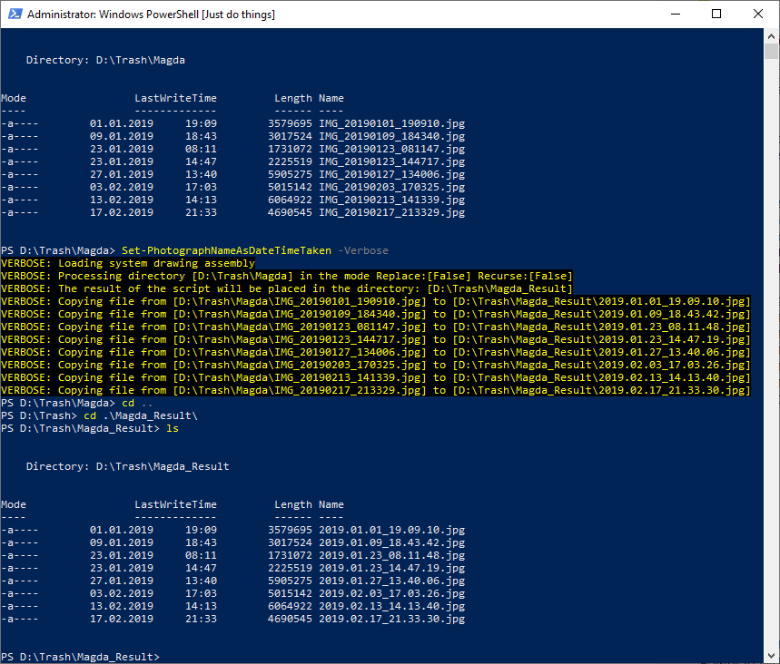
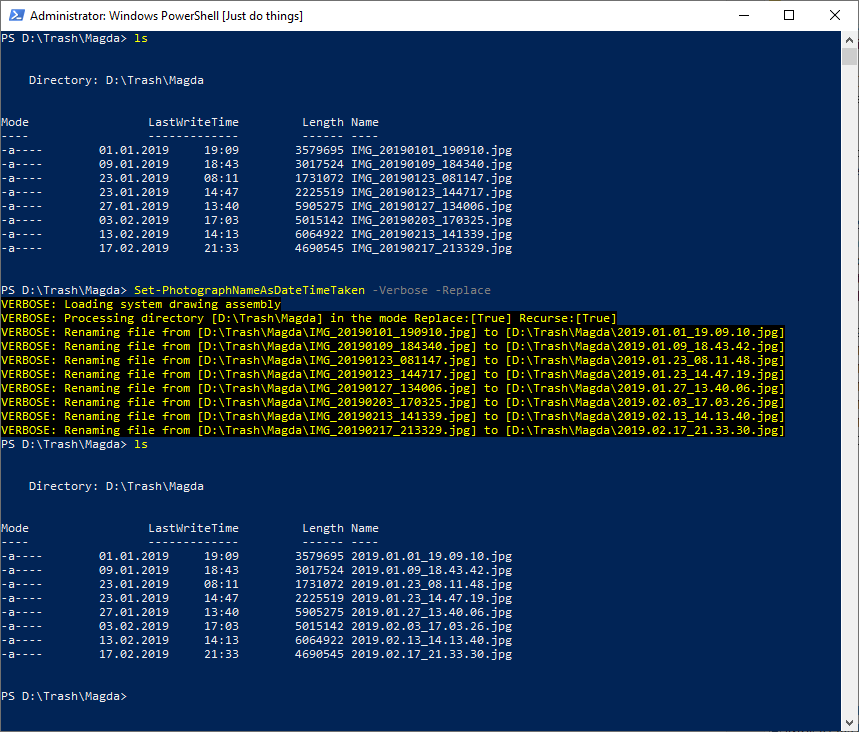

<!--Category:PowerShell--> 
 <p align="right">
    <a href="https://www.powershellgallery.com/packages/ProductivityTools.SetPhotographNameAsDateTimeTaken/"></a>
    <a href="http://productivitytools.tech/set-photographnameasdatetimetaken/"><a> 
    <a href="https://github.com/pwujczyk/ProductivityTools.SetPhotographNameAsDateTimeTaken"></a>
</p>
<p align="center">
    <a href="http://http://productivitytools.tech/">
        
    </a>
</p>

 
# Set Photograph name as date time taken
Module extracts date and time from picture and change name of the picture to it. It uses format yyyy.MM.dd_hh.mm (2013.08.30_13.08.31).

<!--more-->
Module allows to use -Recurse switch. By default it creates directory at the same level as working directory with images which have new name.

````powershell
Set-PhotographNameAsDateTimeTaken -Recurse -Verbose
````

<!--og-image-->



After some trust to the module will be gained, -Replace switch can be used, which will rename files instead of copying them.

```powershell
Set-PhotographNameAsDateTimeTaken -Recurse -Verbose -Replace
```

<!--og-image-->
